  

  
  
  

  <strong>İşe yarayan, sessiz çalışan araçlar.</strong> 
  Small native utilities, local-first AI workflows and privacy-aware automation.

## Currently building

| Project | What it does | Built with |
| --- | --- | --- |
| [🕰️ **ClockScrambler**](https://github.com/benfirad/ClockScrambler) | Turns the macOS menu-bar clock into emoji, written time or a background-aware live clock. | `Swift` `AppKit` |
| [🧠 **daakRAM**](https://github.com/benfirad/daakRAM) | Watches real memory pressure and gives you safe, native app controls. | `Swift` `macOS` |
| [💡 **daakREMEMBER**](https://github.com/benfirad/daakREMEMBER) | Captures a thought before it disappears and syncs it privately over Tailscale. | `Swift` `Tailscale` |
| [🎙️ **daakDİKTE**](https://github.com/benfirad/daakDIKTE-macos) | A Turkish-friendly native macOS edition of [Yusuf İpek's Dikte](https://github.com/yusufipk/dikte), with local Whisper and Codex CLI support. | `Python` `PyQt6` |
| [🛡️ **daakLOLILE**](https://github.com/benfirad/daakLOLILE) | Runs Tor/Snowflake, system telemetry and pressure-aware maintenance with safe power modes. | `PowerShell` `macOS` `Windows` |

## The toolbox

  
  
  
  
  
  

- Native macOS menu-bar apps that stay out of the way.
- Local-first speech, AI and automation whenever practical.
- Small interfaces, reversible actions and honest system telemetry.
- Open-source work documented in both Turkish and English.

## Contribution motion

  <picture>
    <source media="(prefers-color-scheme: dark)" srcset="https://raw.githubusercontent.com/benfirad/benfirad/output/github-contribution-grid-snake-dark.svg">
    <source media="(prefers-color-scheme: light)" srcset="https://raw.githubusercontent.com/benfirad/benfirad/output/github-contribution-grid-snake.svg">
    
  </picture>

  Build small. Verify the real thing. Share what survives the test.

